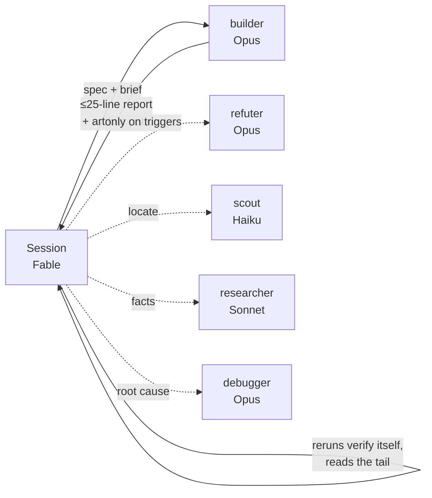

# claude-code-fable-orchestrator

**Fable as the orchestrator, cheaper models as the workers.** A Claude Code plugin with five subagents — scout (Haiku), researcher (Sonnet), builder (Opus), refuter (Opus), debugger (Opus) — two session modes, a brief template for every agent call, and a `/handoff` skill so a new session resumes from a file instead of rebuilding context. On Fable, the session plans, dispatches, and verifies; it never reads whole codebases or writes deliverables. On Opus or Sonnet, it works directly and hands off only searches, research, and bulk edits.

```
/plugin marketplace add pithpusher/claude-code-fable-orchestrator
/plugin install claude-code-fable-orchestrator@pithpusher
```

## Contents

- [Install](#install)
- [Enforcement: the guard hook](#enforcement-the-guard-hook)
- [Which model should each Claude Code subagent use?](#which-model-should-each-claude-code-subagent-use)
- [How delegation works](#how-delegation-works)
- [How do I keep Fable's context light?](#how-do-i-keep-fables-context-light)
- [Trim the base context](#trim-the-base-context)
- [Does parallel multi-agent work hurt quality?](#does-parallel-multi-agent-work-hurt-quality)
- [The brief template](#the-brief-template)
- [Claude Code settings that control subagent models](#claude-code-settings-that-control-subagent-models)
- [FAQ](#faq)
- [Origin and credits](#origin-and-credits)

## Install

1. Add the marketplace and install the plugin (agents + `/handoff` skill):

   ```
   /plugin marketplace add pithpusher/claude-code-fable-orchestrator
   /plugin install claude-code-fable-orchestrator@pithpusher
   ```

2. Copy the orchestration rule — plugins can't ship rules, so this one step is manual:

   ```bash
   cp rules/agents.md ~/.claude/rules/fable-orchestrator.md
   ```

3. Merge [`settings.snippet.json`](settings.snippet.json) into `~/.claude/settings.json`:

   ```json
   {
     "model": "claude-fable-5-1",
     "fallbackModel": ["sonnet"],
     "env": { "CLAUDE_CODE_SUBAGENT_MODEL": "sonnet" }
   }
   ```

4. Turn on the output style — it puts the orchestrator contract in the system prompt, where it outranks rules files:

   ```json
   { "outputStyle": "Orchestrator" }
   ```

5. Restart Claude Code. Ask it to dispatch each of `scout`, `researcher`, `builder`, `refuter`, `debugger` on a trivial task; ask it to write a 50-line file directly and confirm the hook denies it.

No MCP servers, no background processes. Five agents, one skill, one rule, one output style, and one hook.

## Enforcement: the guard hook

Rules are advice, and a strong orchestrator will argue its way past advice — five test runs showed Fable building the deliverable itself whenever the task felt like "analysis." So the plugin ships a `PreToolUse` hook that makes the contract mechanical for the **main session only** (subagents are never restricted — their own tool grants constrain them):

| Main-session call | Result |
|---|---|
| `Agent` with `Explore`, `Plan`, or `general-purpose` | denied — use the five roles |
| `Write` over 40 lines to a project file | denied — brief the builder |
| `Edit` inserting over 10 lines into a project file | denied — brief the builder |
| Bash or PowerShell that writes a project file (heredoc, redirect, `sed -i`, `cp`, `tee`, inline `python -c` / `node -e`, `Set-Content`, `bash -c "…"` wrappers, awk `>`) | denied — brief the builder |
| `git restore`, `checkout -- <path>`, `reset --hard`, `stash pop`, `clean -f` | denied — these overwrite project files |
| Anything in the scratchpad, `HANDOFF.md`, or `~/.claude` | allowed |

**Fable only.** The hook enforces nothing unless the session model is Fable. Hook input carries no model field, so it reads the transcript's newest assistant entry or `/model` switch, falling back to `model` in `settings.json`. Plan on Fable, `/model opus`, and the same session executes with no restrictions. The rule file and output style carry the same scope line.

The denial message tells the orchestrator what to do instead. It is a pattern match on the command text, not a sandbox. Known gaps: a script that lives in the scratchpad but writes into the project, in-place edits wrapped in `find -exec` or `xargs`, wrappers prefixed with `env` or `nohup`, and deletions (`rm`). The output style tells the orchestrator those are the same violation.

## Which model should each Claude Code subagent use?

| Agent | Model | Can edit project files | Job | Never does |
|-------|-------|:---:|-----|------------|
| `scout` | Haiku 4.5 | – | Find files, symbols, call sites. Returns `path:line` + one line of context, never file bodies. | Read whole files, propose fixes |
| `researcher` | Sonnet 5 | – | Establish facts from docs, source, or URLs, with citations. Unverifiable → `UNVERIFIED:`. | Edit project files, recommend unasked |
| `builder` | Opus 5 | **yes** | Implement a clear spec in the listed files, run the verify command, report the diff. | Expand scope, review itself |
| `refuter` | Opus 5 | – | Read the real diff, rerun the verify command itself, return `ACCEPT` / `REWORK`. | Edit anything, trust a summary |
| `debugger` | Opus 5 | – | Root cause with reproduction evidence and a proposed fix. | Apply the fix |
| *session on Fable* | Fable 5.1 | one-liners only | Lean orchestrator: write specs, dispatch, verify, integrate. | Read large code, bulk refactor, write deliverables |
| *session on Opus / Sonnet* | Opus 5 / Sonnet 5 | yes | Hands-on lead: do the work, delegate searches, research, and bulk edits. | Dispatch agents for work it can do in a few calls |

**Only the builder has the `Edit` tool, and only one builder runs at a time.** That single constraint is what makes "never two agents editing the same files" enforceable instead of aspirational.

The orchestrator does trivial things itself — a one-line fix, a single grep, a file under 40 lines. Spawning an agent for those costs more than doing them. The guard hook draws the same line mechanically.

## How delegation works



**On Fable (lean orchestrator):**

1. The session writes the spec into a brief, one brief per feature. `KNOWN FACTS` carries the previous artifact's **path**, not its contents.
2. The builder makes the change, runs the verify command, and returns ≤25 lines.
3. The session reruns the verify command itself in one call and reads the last 20 lines. On failure it re-briefs the same builder once with the output, then intervenes.
4. The refuter runs only for security, auth, payments, or user data; migrations or deletions; changes across more than ~5 files; or on request.
5. The next step never starts while the current one is unverified.

**On Opus or Sonnet (hands-on lead):** the session reads and edits directly. It sends unknown-location searches to the scout, doc or web facts to the researcher, bulk mechanical edits to the builder with `model: "sonnet"`, and hard bugs to the debugger. The refuter triggers are the same.

Earlier versions ran the refuter on every phase. That cost 50–60k tokens per phase on top of the builder, which often made the loop more expensive than plain prompting. Verifying with one command costs one turn.

## How do I keep Fable's context light?

Three mechanisms, all enforced by the agent definitions rather than by hoping:

- **Output caps.** Every agent has a max-lines rule in its definition (scout 40, builder 25, refuter 30). Anything longer goes to a scratch file and the agent returns the path.
- **Artifact paths, not contents.** The next phase's brief references the previous artifact by path. The orchestrator never holds two phases' worth of diff in context.
- **Verify tails, not diffs.** The orchestrator runs the verify command once and reads the last 20 lines. It doesn't read the diff.
- **Few Fable turns.** Every Fable tool call re-reads the whole context. So the plan file is written once, briefs cover a whole feature, and the session never audits its own transcript.

Plus `/handoff`: at milestones and before context runs low, the orchestrator writes `.claude/HANDOFF.md` (goal, decisions with reasons, done, next step, open questions, verify command; ≤60 lines, overwritten not appended). A fresh session reads it and restates the next step in three lines.

## Trim the base context

Every turn re-reads the full system prompt. A fresh session measured about 102k tokens before the first word. That includes every enabled plugin's skill descriptions, every connector's tool names, and any plugin that injects text at session start.

- **Claude Code plugins:** set unused ones to `false` in `enabledPlugins` in `~/.claude/settings.json`, and re-enable per project in `.claude/settings.json`. Plugins with session-start injections cost the most.
- **App plugins** (legal, sales, marketing, …): turn off in the Claude app's plugin settings.
- **claude.ai connectors:** disconnect the ones you don't use in Claude Code at claude.ai → Settings → Connectors.

## Does parallel multi-agent work hurt quality?

For **writing**, yes. Parallel builders lose shared context, produce integration seams, and collide on files. The evidence points one way:

- Cognition, [*Don't Build Multi-Agents*](https://cognition.ai/blog/dont-build-multi-agents) — parallel subagents making decisions without shared context produce conflicting work.
- Anthropic, [*How we built our multi-agent research system*](https://www.anthropic.com/engineering/built-multi-agent-research-system) — parallelism paid off for breadth-first *reading*; coding was explicitly harder to parallelize.
- Cemri et al., [*Why Do Multi-Agent LLM Systems Fail?*](https://arxiv.org/abs/2503.13657) (MAST) — a taxonomy where most failures are specification and inter-agent misalignment, not model capability.
- GitHub's [Project HydraFusion](https://github.blog/ai-and-ml/github-copilot/project-hydrafusion-frontier-quality-via-multi-model-orchestration/) — multi-model orchestration beat Opus 5 on one benchmark and regressed 1.5 points on DeepSWE.

So this plugin allows parallelism only for **read-only** agents (scout, researcher, refuter, debugger) and for side work in a separate directory where no conflict is possible. Writing is sequential. If you're not willing to trade quality for cost or wall-clock, this is the setting that matters.

One more thing this gets right that most "spawn a critic" setups get wrong: **a weaker critic reviewing a stronger drafter is a downgrade, not independence.** Genuine critique independence needs a different model family. Within one family, the reviewer must be at least as strong as the writer — so the refuter is Opus, same as the builder.

## The brief template

Every `Agent` call gets a brief in this exact shape. Fill every line; `n/a` is a valid answer, silence is not.

```
GOAL: <one sentence, testable>
SCOPE: <exact files / dirs / URLs — nothing else>
MAY CHANGE: <files> | none
MUST VERIFY: <exact command or check>
DO NOT: <refactor, touch tests, read outside scope, install packages, ...>
KNOWN FACTS: <already established — do not rediscover>
OUTPUT: <format from the agent definition>, max <N> lines
SCRATCH: <absolute scratchpad path> — anything longer goes here; return the path
```

The agent definitions each specify their output format, so `OUTPUT` usually just says "your standard format, max 20 lines".

## Claude Code settings that control subagent models

Four layers, most specific wins:

```
Agent tool `model` param  >  agent frontmatter `model:`  >  CLAUDE_CODE_SUBAGENT_MODEL  >  session model
```

| Setting | Where | What it does |
|---------|-------|--------------|
| `model:` in agent frontmatter | `~/.claude/agents/<name>.md` | Pins one agent. Accepts `haiku`, `sonnet`, `opus`, `fable`, `inherit`, or a full model ID. This plugin pins all five. |
| `CLAUDE_CODE_SUBAGENT_MODEL` | `env` block in `settings.json` | Default for every subagent with no `model:` — including built-in `Explore`/`Plan` and other plugins' agents. |
| `model` | `settings.json` | The session (orchestrator) model. `claude-fable-5-1` here. |
| `fallbackModel` | `settings.json` | Availability failover when the session model is overloaded. Not a quality cascade. |
| `availableModels` | `settings.json` | Hard allowlist. An agent pinned to a model outside it inherits the parent model instead. Also trims your `/model` picker. |

The `model` param on the `Agent` tool is for changing a single call — `sonnet` for a trivial, tightly-specified builder phase, or a re-run one tier up. Not for routine dispatch.

## FAQ

**Why is the builder on Opus and not Sonnet?**
Because the refuter no longer runs on every step, the builder's first draft is usually what ships. If you'd rather trade quality for cost, change one line in `agents/builder.md` (`model: sonnet`); the refuter stays Opus either way.

**Doesn't delegation cost more tokens than just prompting?**
It can. Every agent starts cold. The old always-on refuter reread everything the builder wrote. Delegation pays off when it moves many-turn reading and writing off the expensive session model. For a one-file fix, do it inline, which is what both modes say.

**Can I use this without Fable?**
Yes. On Opus or Sonnet the session runs in hands-on lead mode: it works directly and delegates searches, research, and bulk mechanical edits. The guard hook only enforces on Fable.

**Why Haiku for the scout?**
Scouting is `grep`/`glob` with a strict "locations only" output. It's the one role where the cheapest model is genuinely enough, and it runs often.

**Does this replace `/plan` or the built-in `Explore` and `Plan` agents?**
No. It adds five agents alongside them. `CLAUDE_CODE_SUBAGENT_MODEL=sonnet` also drops `Explore`/`Plan` to Sonnet, which is usually what you want.

**Where do scratch files go?**
The `SCRATCH` line in each brief. Claude Code exposes a per-session scratchpad directory; use that path. Researcher and debugger may only write there; builder writes its artifact there.

**How is this different from HydraFusion or other model routers?**
Those route *per request* with a learned policy. This routes *per role* with a fixed pin, and puts the cost/quality bet in one place (builder + refuter both Opus). No runtime router exists in Claude Code; this is the closest static equivalent.

**Why not ship the rule inside the plugin?**
Plugins can install agents, skills, commands, hooks and MCP servers. They don't install rules files, so `rules/agents.md` is a one-time copy.

## Origin and credits

The role split — Fable orchestrates, Haiku scouts, Sonnet researches, Opus refutes — comes from [*How I use subagents without burning through Fable*](https://www.reddit.com/r/ClaudeCode/comments/1wbc03f/how_i_use_subagents_without_burning_through_fable/) on r/ClaudeCode. This repo turns it into installable agent definitions, adds the strictly-sequential rule and the artifact-path pattern, and makes the refuter rerun verification itself.

## License

MIT
